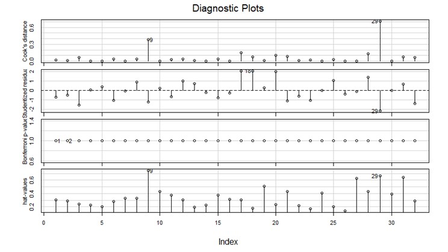

# Multiple Linear Regression Model basic analysis in R.
Statistical Modelling project
----------------------------------------------------------------------
Important notes:
* Files to be read must be in the same directory with the project 
----------------------------------------------------------------------
In this project a multiple linear Regression Model is fitted. Features are examined via various methods like VIF etc. Then model is optimised using Diagnostics like AIC and others.

----------------------------------------------------------------------
Some examples:
Correlation Matrix for the features examined:

Some Diagonostic Plots:
